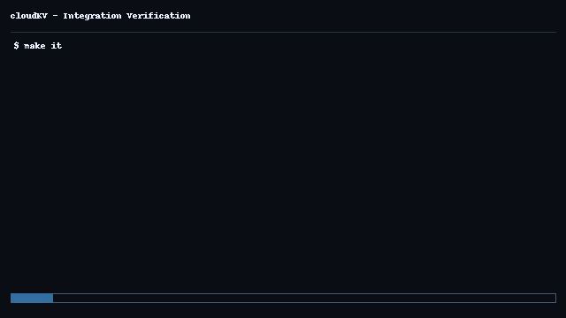

# cloudKV

<p align="left">
  
  
  
  
  
  
  
  
  
  
  
  
  
  
</p>

**A Concurrent Java Key–Value Store** with **RESTful**, **SQL**, **XML/XSLT/XQuery**, and **HTTPS** infrastructure features.

[]

## Highlights

* **Java Web Server (REST/JAX‑RS + HTTPS):** Jetty 11 with Jersey 3 (HTTP/1.1), dev HTTPS profile, consistent status codes and error schema.
* **SQL & Transactions (ACID awareness):** Transaction overlay with BEGIN/COMMIT/ROLLBACK; commit‑time persistence via JDBC/H2; rollback discards staged writes.
* **Concurrency in a Web‑Server Context:** Thread‑safe CHM core, atomic commits, background TTL sweeper using ScheduledExecutorService under concurrent clients.
* **XML Technology Stack:** /export/xml snapshot, XSLT transform to /export/html, and read‑only XQuery via Saxon s9api at /export/query.
* **SOAP Interop (JAX‑WS):** Minimal SOAP wrapper (Metro) on port 8090 for get/put/delete, demonstrating familiarity beyond REST.
* **LLM/AI API Familiarity:** NLQ endpoint maps simple English → deterministic XQuery templates; optional pluggable LLM client behind a feature flag.

## 🧱 Architecture (high‑level)

```
Client (curl/Postman/SPA)
        │  HTTP/JSON           SOAP
        │                      8090
        ▼                      │
  Jetty + Jersey (8080)   JAX‑WS Endpoint
     /kv /tx /health           (KVSoap)
        │                          │
        ├── Service Layer (TxManager, ExportService, SearchResource)
        │
        ├── ConcurrentKVStore (CHM<ValueEntry>)
        │
        └── JDBC/H2 (commit‑time write‑through)
```

## 🔧 Tech Stack

* **Language**: Java 17
* **Web**: Jetty 11, Jersey 3 (JAX‑RS)
* **XML/XSLT/XQuery**: Saxon‑HE (s9api), XSLT 3.0 stylesheet
* **SOAP**: Metro JAX‑WS RI (Jakarta 4.x)
* **Persistence**: JDBC/H2 (commit‑time)
* **Concurrency**: CHM, `ScheduledExecutorService`
* **Build/CI**: Gradle 9 (Kotlin DSL), GitHub Actions, Makefile


## Example Test Run Output

```bash
 root@Nayla mnt/..../cloudKV  CI  scripts/it_http_mvp.sh

# HEALTH
RESPONSE: {"status":"UP"}

# CRUD: CREATE
RESPONSE: {"status":"OK"}

# CRUD: READ
RESPONSE: {"key":"foo","value":"bar","createdAtMs":1760478701652}
{
  "key": "foo",
  "value": "bar",
  "createdAtMs": 1760478701652
}

# CRUD: UPDATE
RESPONSE: {"status":"OK"}
{
  "status": "OK"
}
RESPONSE: {"key":"foo","value":"baz","createdAtMs":1760478701764}
{
  "key": "foo",
  "value": "baz",
  "createdAtMs": 1760478701764
}

# CRUD: DELETE
DELETE HTTP CODE: 204
RESPONSE: {"error":"NOT_FOUND"}

# TTL
RESPONSE: {"status":"OK"}
RESPONSE: {"error":"NOT_FOUND"}

# TX: BEGIN -> PUT -> COMMIT
RESPONSE: {"txId":"45752f20-721f-4f79-97e1-6803e37a20e6"}
RESPONSE: {"status":"OK"}
{
  "status": "OK"
}
RESPONSE: {"status":"COMMITTED"}
{
  "status": "COMMITTED"
}
RESPONSE: {"key":"order123","value":"pending","createdAtMs":1760478703974}

# TX: ROLLBACK
RESPONSE: {"txId":"fbb668c0-4696-45f3-a777-ccf021e5015d"}
RESPONSE: {"status":"OK"}
RESPONSE: {"status":"ROLLEDBACK"}
RESPONSE: {"error":"NOT_FOUND"}

# CONCURRENCY: 5 parallel writes
RESPONSE: {"key":"k3","value":"v3","createdAtMs":1760478704138}

# XML/XSLT/XQuery
RESPONSE: <store><entry key="foo"><value>baz</value></entry><entry key="k1"><value>v1</value></entry><entry key="k2"><value>v2</value></entry><entry key="k3"><value>v3</value></entry><entry key="k4"><value>v4</value></entry><entry key="k5"><value>v5</value></entry><entry key="order123"><value>pending</value></entry></store>

# SOAP (JAX-WS)
RESPONSE: <wsdl:definitions xmlns:wsdl="http://schemas.xmlsoap.org/wsdl/" xmlns:soap="http://schemas.xmlsoap.org/wsdl/soap/" xmlns:tns="http://api.modules.cloudkv/" xmlns:xsd="http://www.w3.org/2001/XMLSchema" name="KVService" targetNamespace="http://api.modules.cloudkv/"><wsdl:service name="KVService"><wsdl:port name="KVSoapPort" binding="tns:KVSoapBinding"><soap:address location="http://0.0.0.0:8090/soap/kv"/></wsdl:port></wsdl:service></wsdl:definitions>

# NLQ Adapter
RESPONSE: { "xquery": "for $e in /store/entry[starts-with(@key,'k')] return $e" }

✅ All HTTP MVP integration tests passed.
```

## Configuration & Feature Flags

Toggle optional components via environment variables. Defaults are safe for local development.

| Flag                 | Default | Description                                                                                                       |
| -- | :--: | -- |
| `XML_EXPORT_ENABLED` |  `true` | Enables XML snapshot, XSLT HTML transform, and XQuery endpoints (`/export/xml`, `/export/html`, `/export/query`). |
| `SOAP_ENABLED`       | `false` | Publishes the JAX-WS SOAP service at `http://0.0.0.0:8090/soap/kv`.                                               |
| `LLM_ENABLED`        | `false` | Activates the NLQ → LLM pathway (deterministic template mapping remains the fallback).                            |
| `LLM_PROVIDER`       |   `""`  | Provider name/key used only when `LLM_ENABLED=true`.                                                              |

**Ports**

* REST (Jetty/Jersey): **8080**
* SOAP (JAX-WS): **8090** (only when `SOAP_ENABLED=true`)


## Quick Start (Linux/WSL)

```bash
# 1) Prerequisites
sudo apt update
sudo apt install -y openjdk-17-jdk curl jq

# 2) Clone & build
git clone https://github.com/danigallegdup/cloudKV.git
cd cloudKV
./gradlew :modules:api-rest:build

# 3) Run REST server (8080)
XML_EXPORT_ENABLED=true \
SOAP_ENABLED=false \
LLM_ENABLED=false \
./gradlew :modules:api-rest:run
# → cloudKV running on http://localhost:8080
```

> HTTPS (dev): self‑signed keystore is wired for local profiles; REST examples below use HTTP for convenience.

## Security Notes (dev focus) (dev focus)

* Dev HTTPS uses a self‑signed keystore; do **not** reuse in production.
* XQuery endpoint is **read‑only** and runs against an in‑memory snapshot.
* NLQ mapping is deterministic by default; any LLM usage is opt‑in and isolated.

## MIT License

Licensed under the MIT License. See [LICENSE](LICENSE) for details.